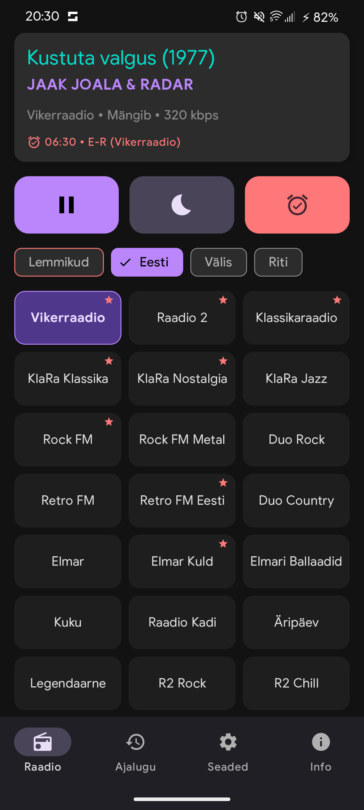
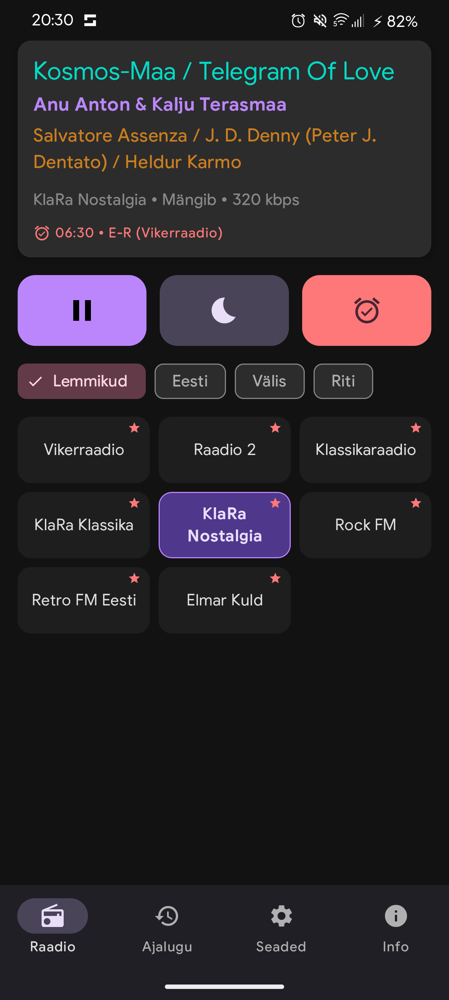
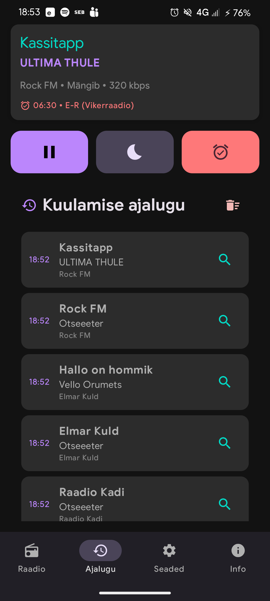
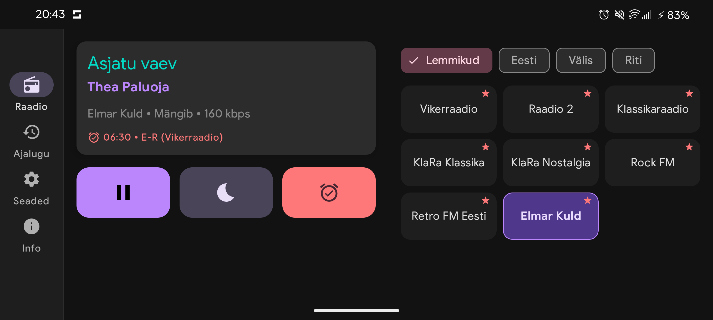
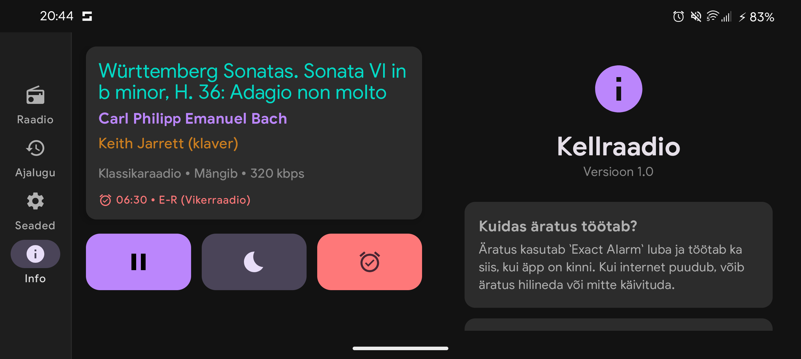

# Kellraadio

Kellraadio on Android-platvormile loodud raadiopleier ja äratuskell, mis keskendub stabiilsele heli esitusele, täpsele ajastusele ja optimaalsele kasutajakogemusele erinevates seadmetüüpides. Rakendus on arendatud järgides kaasaegseid Androidi arendusstandardeid ja materjalidisaini põhimõtteid.

## Funktsionaalsus

* **Täpne äratussüsteem**: Rakendus kasutab `AlarmManager.setAlarmClock` API-t ning `USE_EXACT_ALARM` ja `SCHEDULE_EXACT_ALARM` õiguseid, mis tagab raadiostriimi tõrgeteta käivitumise ka süsteemi energiasäästurežiimide (Doze mode) ajal. Äratuse ajastus sünkroonitakse automaatselt seadme alglaadimise järgselt (`BootReceiver`).
* **Katkematu taustaheli**: Heli esitust haldab `MediaPlayback`-tüüpi Foreground Service (`RadioService`) koos `WakeLock` süsteemiga ja kohandatud timeout-loogikaga (nt auto Bluetooth-sünkroonimiseks), vältides süsteemi poolt heli peatamist taustal töötades.
* **Laulusõnade ja kaanepiltide otsing (Lyrics & Cover Art)**: Reaalajas toimiv esitatava loo metaandmete tuvastamine. Rakendus otsib automaatselt laulu detaile iTunes API-st, lyrics-päringuid LRCLIB-ist ning vajadusel varulahendusena MusicBrainz/Cover Art Archive süsteemidest, tehes seda koos nutika ignoreerimisfiltriga (nt "Otseeeter", "Uudised", "Saatepaus").
* **Kasutaja jaamad ja globaalne otsing**: Lisaks dünaamilisele, GitHubi gistist laetavale jaamade nimekirjale saavad kasutajad ise lisada oma striime ja otsida tuhandeid jaamu üle maailma läbi integreeritud Radio Browser API (koos ebasoovitavate riikide/jaamade filtreerimisega).
* **Lemmikjaamade järjekorra haldus**: Võimalus märkida jaamu lemmikuteks ning neid käsitsi loetelus üles/alla või otse algusesse/lõppu liigutada, kasutades andmebaasi-põhist `favoriteOrder` indekseerimist.
* **Avakuva vidin (Glance Widget)**: Modernne avakuva vidin, mis on loodud kasutades Jetpack Glance raamistikku ja toetab seadete alt reguleeritavat tausta läbipaistvust (`widgetTransparency`).
* **Android TV & Leanback tugi**: Rakendus toetab täielikult Android TV seadmeid koos spetsiaalse käivitajaga (`LEANBACK_LAUNCHER`) ning spetsiifilise loogikaga (näiteks meedia automaatne seiskamine, kui TV vaade taustale lükatakse).
* **Unetaimer (Sleep Timer)**: Integreeritud unetaimeri funktsioon, mis võimaldab määrata minuti-põhise loenduri heli automaatseks peatamiseks.
* **Adaptiivne kasutajaliides**: Jetpack Compose'is ja Material 3 disainikeeles realiseeritud vaated, mis kohanduvad dünaamiliselt seadme orientatsiooni ja ekraani laiusega (kasutades vastavalt Navigation Bar või Navigation Rail paneele).

## Tehniline teostus

* **UI Framework**: Jetpack Compose (Material 3)
* **Audio Engine**: AndroidX Media3 (ExoPlayer, HLS Extension ja MediaSession integratsioon)
* **Persistence Layer**: Room Persistence Library (SQL-põhine andmehaldus jaamade, ajaloo ja äratuste jaoks)
* **Widgets**: AndroidX Glance (Material 3 Glance-appwidget)
* **Networking**: Retrofit 2, OkHttp 4 ja Kotlinx Serialization (JSON parseerimiseks)
* **Image Loading**: Coil-Compose (võrgu piltide ja kaanepiltide kuvamiseks)
* **Asynchrony**: Kotlin Coroutines ja StateFlow reaalajas andmevahetuseks
* **Architecture**: MVVM muster koos Repository andmekihiga

## Kasutajaliides

### Mobiilne vaade

  
  
  

### Tahvelarvuti ja rõhtvaade (Landscape)

  
  

## Tehnilised väljakutsed ja erilahendused

### Bluetooth metaandmete sünkroonimine (Skoda/VW tugi)
Internetiraadio striimide puhul esineb sageli viivitusi või ühilduvusprobleeme välis-seadmetega (nt autode multimeediasüsteemid Skoda, VW grupi mudelid). Rakenduses on rakendatud spetsiaalne `MediaMetadata` sünkroonimise loogika, mis simuleerib meedia staatust ja fikseeritud kestust, et sundida Bluetooth-vastuvõtjat andmeid reaalajas uuendama ilma teenust või ühendust katkestamata.

### Skaleeritav kasutajakogemus
Rõhtasendis (Landscape) arvutab rakendus ekraani laiuse (dp ühikutes) ja jaotab mängija ning sisu vahelise ruumi dünaamiliselt. See tagab, et kasutajaliides on ühtviisi loetav ja mugavalt kasutatav nii kompaktsetes telefonides, tahvelarvutites kui ka Android TV seadmetes.

### Andmebaasi migratsioon ja terviklikkus
Rakendus haldab Room andmebaasis kolme tabelit: `stations` (raadiojaamad), `history` (kuulamisajalugu) ja `alarms` (äratused). Rakendatud on migratsiooniloogika (nt versiooniuuendus 8 -> 9, mis lisas `favoriteOrder` tulba), säilitades kasutaja poolt salvestatud andmete terviklikkuse ja hoides kuulamisajaloo puhtana ilma korduvate tühjade sissekanneteta ("Otseeeter" asendusloogika).

## Paigaldamine ja nõuded

* **Operatsioonisüsteem**: Android 8.0 (API 26) või uuem.
* **Sihtplatvorm**: targetSdk ja compileSdk on seatud tasemele 36.
* **Nõutavad õigused**:
  * `android.permission.INTERNET` (striimide ja metaandmete allalaadimiseks)
  * `android.permission.POST_NOTIFICATIONS` (Foreground Service teavituse kuvamiseks)
  * `android.permission.USE_EXACT_ALARM` ja `android.permission.SCHEDULE_EXACT_ALARM` (täpse äratuse käivitamiseks)
  * `android.permission.FOREGROUND_SERVICE` ja `android.permission.FOREGROUND_SERVICE_MEDIA_PLAYBACK` (katkematuks taustamänguks)
  * `android.permission.WAKE_LOCK` (protsessori ärvel hoidmiseks äratuse ajal)
  * `android.permission.RECEIVE_BOOT_COMPLETED` (äratuste sünkroonimiseks seadme käivitamisel)

## Litsents

Projekt on arendatud õppe- ja isiklikuks otstarbeks. Kõik edastatavad raadiostriimid ja nendega seotud kaubamärgid kuuluvad vastavatele ringhäälinguorganisatsioonidele.
