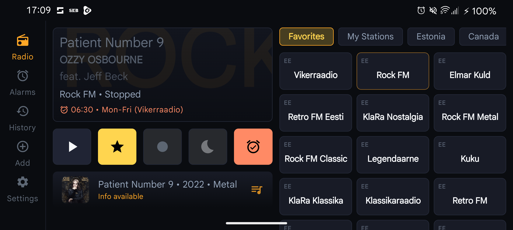
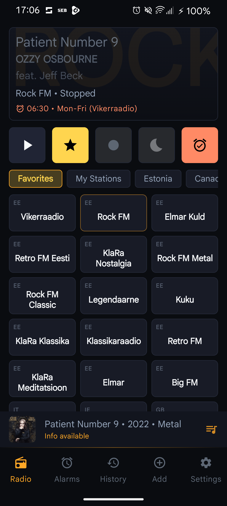
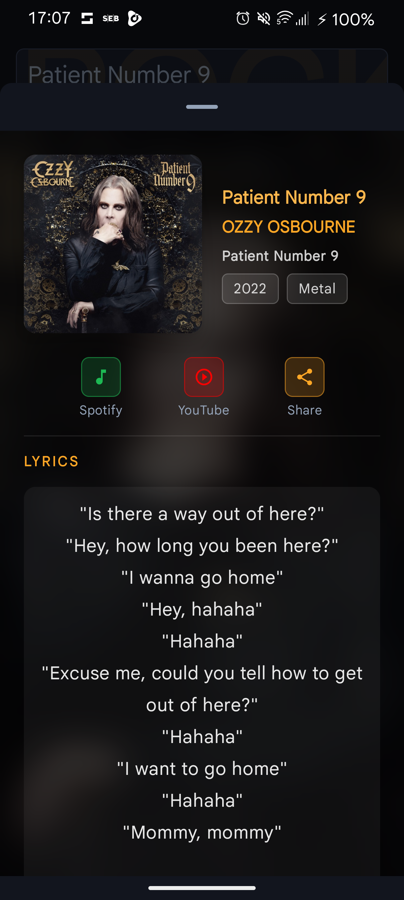
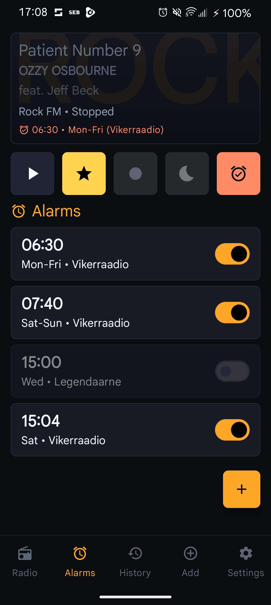
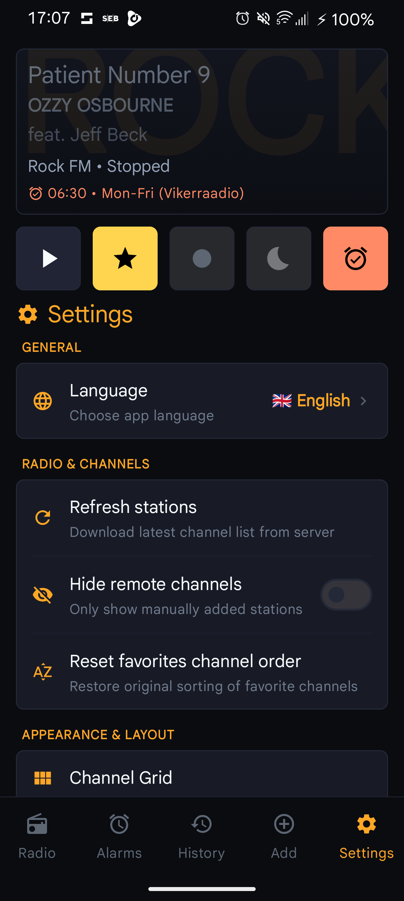
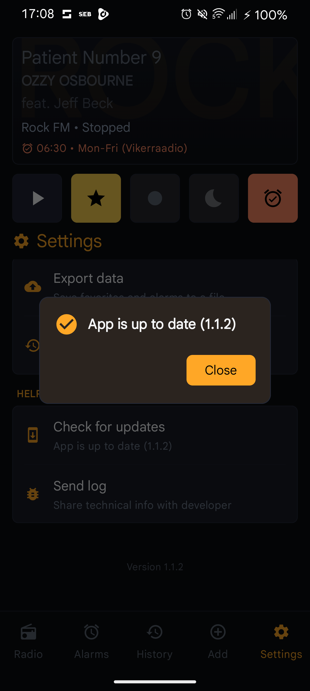
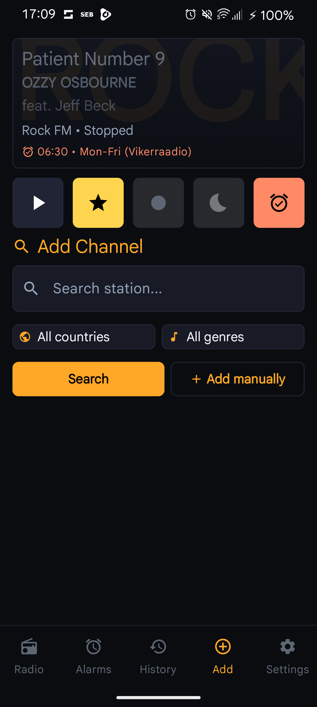

# 📻 Kellraadio

<p align="center">
  
</p>

<p align="center">
  <strong>The Dieter Rams / Braun-inspired Hi-Fi Internet Radio, Smart Clock & Stream Recorder for Android.</strong>
  <br>
  <em>Designed for pure audio clarity, tactile precision, and zero-distraction listening.</em>
</p>

<p align="center">
  <a href="https://github.com/marugusu/Kellraadio-releases/releases/latest"></a>
  <a href="https://developer.android.com/about/versions/14"></a>
  <a href="https://developer.android.com/jetpack/compose"></a>
  <a href="https://developer.android.com/media/media3"></a>
  <a href="#-crafted-with-ai-pair-programming"></a>
</p>

<p align="center">
  <a href="https://github.com/marugusu/Kellraadio-releases/releases/latest">
    
  </a>
</p>

---

## 🤖 Crafted with AI Pair Programming

> *"The future of software engineering isn't writing boilerplate by hand — it's human architectural vision amplified by autonomous agentic precision."*

**Kellraadio is built 100% via pair programming between a human architect and an advanced autonomous AI coding agent ([Google Antigravity](https://deepmind.google/)).**

Instead of relying on generic templates or superficial code snippets, this repository was engineered through deep agentic workflows:

* **Autonomous Full-Stack Refactoring**: Seamlessly migrated legacy codebases, refactored entire architecture to clean MVVM with Kotlin Coroutines & Flow, and implemented custom Room migrations without a single byte of user data loss.
* **Deterministic Guardrails & Project Skills**: The agent operates under strict project rules (`.agents/rules/`) and custom domain skills (`.agents/skills/`) for Jetpack Compose, Retrofit networking, SQLite migrations, and release publishing.
* **Complex Real-World Bugfixes**:
  * **Automotive Bluetooth Sync Engine**: Solved the notorious VW/Skoda/Audi MIB infotainment metadata desynchronization bug by architecting a specialized `MediaMetadata` simulation loop in `RadioService`.
  * **Independent In-App Updater**: Conceived and built an in-app updater that bypasses the Google Play Store, downloads directly from GitHub Releases with live byte streaming, and auto-launches package installation upon permission return.
* **Zero-Friction Release Pipeline**: Built automated tooling (`tools/publish_release.py`) that links Windows Credential Manager to GitHub APIs, packaging and publishing signed releases in seconds without opening a browser.

---

## ✨ Features & Highlights

### 🎛️ Dieter Rams / Braun Hi-Fi Aesthetic
Inspired by classic 1960s Braun audio equipment and Dieter Rams' *Ten Principles for Good Design*:
* **Obsidian & Warm Amber Theme**: Muted titanium surfaces (`#121318`), dark obsidian cards (`#191B24`), and glowing warm amber accent indicators (`#F59E0B`).
* **Tactile Studio Keys**: 8dp precision-rounded tactile switches, unified aspect ratios, and two-zone channel buttons separating channel identity from live playback state.
* **Subtle Dynamic Glow**: Station artwork backlight glow that harmoniously tints the playback stage based on live station identity.

### 🚗 Resilient Automotive Bluetooth Integration
Internet radio streams often choke car infotainment systems (such as VW Group MIB2/MIB3, Skoda, Audi, BMW) due to variable track lengths and metadata drops:
* Kellraadio features a custom **simulated duration loop** in `RadioService`.
* Forces Bluetooth AVRCP metadata refreshing without resetting the audio pipeline or causing audible stuttering.
* Transmits high-res artwork, artist, title, and station name reliably to car instrument clusters and head units.

### 🔄 In-App Self-Updating (No Play Store Required)
* **100% Google-Free Freedom**: The application checks for updates directly from the public GitHub Releases repository (`marugusu/Kellraadio-releases`).
* **Live Byte-Streaming Progress**: Real-time progress bar tracking downloaded bytes vs total size.
* **Lifecycle-Aware Install Flow**: Returning from Android's "Install unknown apps" permission toggle automatically detects the grant and launches the package installer without requiring manual cancel/recheck.

### 🎵 Real-Time Song Intelligence & 1-Tap Streaming
* **Live ICY Metadata Parsing**: Automatically splits raw radio stream metadata into cleanly formatted Artist and Title strings, filtering out ads and station jingles.
* **Multi-Provider Artwork & Lyrics**: Fetches cover art and synchronized lyrics across iTunes, Deezer, LRCLIB, and MusicBrainz.
* **1-Tap Jumps**: Immediately jump from whatever song is currently playing on the radio to search in **Spotify**, **YouTube**, or share to friends via system sheet.

### ⏰ Smart Exact Alarm & High-Fidelity Recording
* **Doze-Bypassing Alarms**: Uses `AlarmManager.setAlarmClock` with exact wakefulness to ensure alarms trigger on the second even in deep battery-saver modes.
* **Gradual Volume Ramping**: Gentle wake-up progression that smoothly ramps radio audio volume over customized intervals.
* **Direct Stream Recording**: Record live broadcasts into clean AAC/M4A audio files, complete with interactive playback seekbar and share functionality.

### 📐 Adaptive Screen Mastery
* **Responsive Layouts**: Seamlessly adapts between portrait phone, dual-pane landscape studio deck, tablet split-view, and Android TV Leanback navigation.

---

## 📸 Visual Showcase

<div align="center">
  <table>
    <tr>
      <td align="center" width="33%">
        <br>
        <b>Tactile Radio Deck</b><br>
        <em>Live stream controls, custom channel grid & station ticker</em>
      </td>
      <td align="center" width="33%">
        <br>
        <b>Live Song Intelligence</b><br>
        <em>High-res artwork, full lyrics & Spotify/YouTube actions</em>
      </td>
      <td align="center" width="33%">
        <br>
        <b>Smart Clock Alarms</b><br>
        <em>Custom wake stations, exact Doze scheduling & snooze</em>
      </td>
    </tr>
    <tr>
      <td align="center" width="33%">
        <br>
        <b>Hi-Fi Settings Panel</b><br>
        <em>Braun-inspired grouped sections & localization</em>
      </td>
      <td align="center" width="33%">
        <br>
        <b>In-App Updater</b><br>
        <em>Automatic GitHub Releases check & background installer</em>
      </td>
      <td align="center" width="33%">
        <br>
        <b>Global Station Browser</b><br>
        <em>Search thousands of stations by country, genre & custom URL</em>
      </td>
    </tr>
  </table>
</div>

---

## 🏗️ Technical Architecture

Kellraadio is built strictly following modern Android development practices, using unidirectional data flow and clean layering:

```
app/src/main/java/app/radiorecalarm/
├── data/                  # Local persistence & remote data sources
│   ├── AppDatabase.kt     # Room 2.6 database (Stations, Alarms, History)
│   ├── Daos.kt            # Coroutine & Flow-enabled Room DAOs
│   └── RadioRepository.kt # Central repository mediating cache & network
├── update/                # Autonomous in-app updater subsystem
│   ├── AppUpdateManager.kt         # Version checking, streaming download & installer
│   ├── GitHubReleaseApiService.kt  # Retrofit service for GitHub Releases API
│   └── GitHubReleaseModels.kt      # DTOs with Kotlinx Serialization
├── service/               # Foreground audio engine
│   ├── RadioService.kt    # AndroidX Media3 ExoPlayer & MediaSession
│   └── BootReceiver.kt    # Automatic alarm restoration on system reboot
├── ui/                    # Jetpack Compose presentation layer
│   ├── MainActivity.kt    # Theme definitions, navigation & container
│   ├── MainViewModel.kt   # UI state machine exposing immutable StateFlow
│   ├── MainUiState.kt     # State representations
│   ├── UpdateDialog.kt    # In-app update modal with progress indicators
│   ├── SongInfoSheet.kt   # Bottom sheet with lyrics & streaming links
│   └── SettingsScreen.kt  # Hi-Fi section panels & preferences
└── widget/                # AndroidX Glance home screen appwidgets
```

### Core Technology Stack

| Layer | Technologies |
|---|---|
| **Language** | Kotlin 2.0+ with Coroutines & StateFlow |
| **UI Framework** | Jetpack Compose, Material 3 (Dark Theme First) |
| **Audio Engine** | AndroidX Media3 (ExoPlayer 1.3+, HLS, MediaSession) |
| **Persistence** | SQLite via Room 2.6 (Explicit Migrations, zero destructive wipe) |
| **Networking** | Retrofit 2, OkHttp 4, Kotlinx Serialization |
| **Image Loading** | Coil 2.6 (Asynchronous image caching & cross-fade) |
| **Widgets** | AndroidX Glance (Material 3 dynamic widget) |
| **Tooling** | Gradle Kotlin DSL (`build.gradle.kts`), Python 3 automation |

---

## 📥 Installation

### Method 1: Direct Download (Recommended)
Download the latest APK directly from the public releases repository:

👉 **[Download Latest Kellraadio APK](https://github.com/marugusu/Kellraadio-releases/releases/latest)**

1. Transfer the `.apk` to your Android device or download directly on your phone.
2. Tap the downloaded file to install.
3. If prompted, grant "Install unknown apps" permission for your browser/file manager.
4. Future updates will be delivered **automatically inside the app**!

---

## 🛠️ Building & Developing

### Prerequisites
* Android Studio Ladybug (2024.2+) or newer
* Android SDK (API 36 compileSdk, minSdk 26)
* JDK 17 or JDK 21

### Local Compilation
```bash
# Clone the repository
git clone https://github.com/marugusu/Kellraadio.git
cd Kellraadio

# Build debug APK
./gradlew assembleDebug

# Run unit tests
./gradlew testDebugUnitTest
```

### Automated Release Publishing
Releases are 100% automated using the custom script:
```bash
# Bumps version, builds APK, and publishes directly to GitHub Releases
python tools/publish_release.py v1.1.3 "Summary of new features"
```

---

## 📜 Agent Guidelines & Rules

This project adheres to the **Antigravity Customization Standard**. AI agents working on this project must consult:
* [PROJECT_RULES.md](file:///c:/Users/margusra/AndroidStudioProjects/Kellraadio/PROJECT_RULES.md) — Index of all agent instructions.
* [.agents/rules/general.md](file:///c:/Users/margusra/AndroidStudioProjects/Kellraadio/.agents/rules/general.md) — Architectural standards & conventions.
* [.agents/rules/git-workflow.md](file:///c:/Users/margusra/AndroidStudioProjects/Kellraadio/.agents/rules/git-workflow.md) — Branching policies & protecting unstaged user tweaks.
* [.agents/skills/release-publisher/SKILL.md](file:///c:/Users/margusra/AndroidStudioProjects/Kellraadio/.agents/skills/release-publisher/SKILL.md) — Release automation runbook.

---

## 📄 License & Acknowledgments

* **License**: Open-source educational and personal project under the MIT License.
* **Radio Streams**: Radio streams and their corresponding trademarks belong to their respective broadcasting organizations.
* **Pair Programmed with**: [Google Antigravity](https://deepmind.google/) advanced agentic coding.
